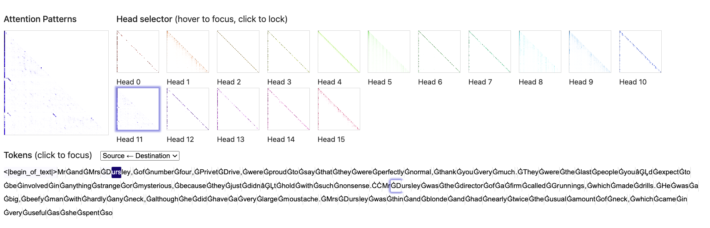
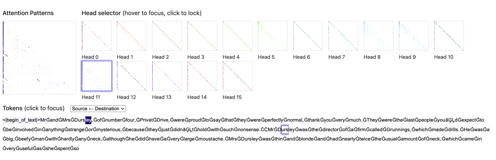

# Отчет по проекту Induction Heads

## 1. Введение

### Описание задачи
В этом проекте пытаюсь повторить статью антропиков про Induction Heads.

### Цели проекта
- Обучить две разные модели (2*attn и conv-attn) и выявить Induction Heads.

---

## 2. Методология

### 2.1 Архитектура модели
- **Первая модель**: двухслойная, первый слой Conv1d, второй слой causal self-attention.
- **Вторая модель**: также двухслойная, только оба слоя это causal self-attention.

### 2.2 Процесс обучения
В качестве датасета для обучения взял **openwebtext**, так как там 9 млрд токенов, а в статье указывалось, что Induction Heads выявляются примерно на 2.5-5 млрд токенах. Поэтому предложенные датасеты пришлось отбросить, так как в TinyStories, например, всего 300 млн токенов. 

Параметры моделей (размерность, количество голов) взяты в основном из самой первой статьи по трансформерам. Параметры обучения все базовые, взяты с туториалов HF. Слой Attention решил написать сам, потому что так интереснее.

### 2.3 Проблемы при обучении
Было несколько серьезных проблем:

- Сначала моделька показывала довольно плохие attention карты, выглядело так, что она вообще не обращала внимание ни на какие токены. Оказалось, что я забыл добавить positional embeddings и сдвинуть токены на один вправо (мне почему-то казалось, что transformers это делают под капотом, но покопался в сурсах, оказывается это происходит не на уровне Trainer, а раньше в самой модели). Сразу же дописал и все стало ок.
- Очень долго шло полное обучение модели, на одной А100 занимало около 60 часов. Добавил torch.compile, время сократилось до 10 часов.

---

## 3. Результаты

  
   <em>Рис. 1: Первая модель, визуализация внимания 4 головы (пример 1)</em>

  
   <em>Рис. 2: Первая модель, визуализация внимания 4 головы (пример 2)</em>

  
   <em>Рис. 3: Первая модель, визуализация внимания 4 головы (пример 3)</em>

Три картинки подряд для первой модели, визуализация внимания 4 головы. Даже по самому паттерну видно наличие induction head. Результаты в целом это подтверждают, видим, что, например, текущий токен "D" в слове "Dursley" смотрит назад не просто на токен "D", но сразу на "urs", что явно указывает на наличие Induction Head.

  
   <em>Рис. 4: Вторая модель, визуализация внимания 11 головы (пример 1)</em>

  
   <em>Рис. 5: Вторая модель, визуализация внимания 11 головы (пример 2)</em>

Здесь на том же примере видим, что проявляются Induction Heads на 11 голове (по сути тоже 4 голова на втором слое).

  
   <em>Рис. 6: Визуализация весов conv слоя</em>

На визуализации видим веса conv слоя, тут отлично видно, что веса получаются "размазанными", что и должно было получиться теоретически, если бы веса повторяли концепцию smeared keys.

---

## 4. Список литературы

1. [A Mathematical Framework for Transformer Circuits](https://transformer-circuits.pub/2021/framework/index.html)
2. [In-context Learning and Induction Heads](https://transformer-circuits.pub/2022/in-context-learning-and-induction-heads/index.html)